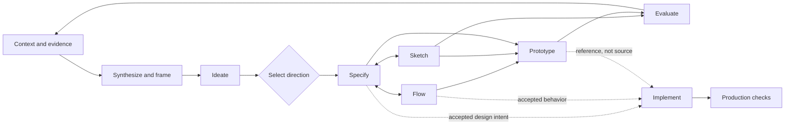

# Agentic Design Workflows

**Status:** Accepted direction; implementation planned
**Date:** 2026-07-24

## Purpose

The framework treats design work as a set of independently runnable,
agent-neutral skills. Skills exchange typed artifact references and may be
composed into optional playbooks. The framework recommends a useful design
loop, but it does not require every project to follow the same order or use
every artifact.

This model keeps individual tasks understandable while allowing an agent to
coordinate longer, resumable workflows when the designer explicitly invokes a
playbook.

## Default Design Loop



Brand, product, audience, voice, design principles, design-system rules,
component catalogs, research, and decisions provide context around this loop.
They are not mandatory lifecycle stages.

The default loop has several deliberate properties:

- synthesis may start from research, feedback, analytics, an initial brief, or
  explicit assumptions;
- ideation produces lightweight concepts before expensive specifications;
- selecting a direction is a declared human or policy-driven checkpoint;
- specifications, flows, and sketches may be created in either order and
  revised together;
- flows, sketches, and prototypes are optional when the design question does
  not need them;
- evaluation produces evidence that can re-enter synthesis;
- production implementation is an explicit side path from accepted design
  intent, not the automatic final stage of a prototype.

## Planned Task-Level Skills

The general design-practice vocabulary is:

- **synthesize** — turn evidence and known context into findings, problem
  frames, opportunities, assumptions, and open questions;
- **ideate** — generate meaningfully different concepts and testable
  hypotheses grounded in the current problem and constraints;
- **specify** — create or revise a living design contract for one selected
  direction;
- **flow** — create or revise a portable behavior graph;
- **sketch** — create inexpensive, usually noninteractive representations for
  exploration or review;
- **prototype** — create a testable simulation to answer a declared question;
- **evaluate** — plan and conduct a review or test, capture sanitized
  observations, and produce findings and recommendations;
- **pitch** — turn accepted evidence and design artifacts into a
  decision-ready change case and optional presentation views;
- **implement** — rebuild accepted design intent in a codebase binding under
  production policy;
- **design-check** — run independent deterministic conformance checks.

Foundation skills such as brand, product definition, voice, theme, and
design-system operations remain independently invokable inputs to the loop.

Internal operations do not become separate user-facing skills unless they have
a recognizably different intent, context, authority boundary, or output.

## Artifact Handoffs

Skills compose through stable artifact IDs, paths, and revisions rather than
copying entire upstream documents into downstream outputs. The expected
evidence and intent chain is:

```text
evidence
→ finding or problem frame
→ concept and hypothesis
→ selected design specification
↔ flow, sketch, or prototype
→ evaluation finding
→ accepted decision
→ production change
```

A design specification is a living contract. It may include user and product
outcomes, hypothesis, scope and non-goals, requirements, content and data
needs, states and edge cases, accessibility expectations, linked artifact
revisions, success criteria, and unresolved questions.

A sketch is defined by its role as a cheap representation, not necessarily by
low visual fidelity. A prototype is defined by its testable question and
behavior. Fidelity (`lo-fi`, `mid-fi`, or `hi-fi`) remains separate from the
prototype constraint profile (`constrained`, `partial`, or `suspended`).

Only information needed across skill or session boundaries must become a
durable artifact. Agents may keep transient reasoning and mechanical
intermediate steps ephemeral.

## Playbooks

A playbook is a declarative, optional graph that composes leaf skills. It
declares:

- skill nodes and their pinned compatible versions;
- artifact inputs and handoffs;
- optional, parallel, and conditional branches;
- readiness conditions;
- human or policy-driven checkpoints;
- retry and feedback edges;
- stopping conditions;
- allowed autonomy and external-effect boundaries.

Invoking one leaf skill runs only that skill and recommends next actions.
Invoking a playbook authorizes an agent to continue through declared safe,
local steps until it reaches a checkpoint, cannot satisfy a readiness
condition, or encounters an unresolved permission boundary.

Canonical artifact changes, external writes, production changes, destructive
operations, and version-control effects retain their normal permission
requirements. A playbook invocation does not silently broaden authority.

## Completion, Acceptance, and Readiness

`done` is not a single boolean. Every skill result distinguishes:

1. **Execution status** — whether the skill ran and produced contract-valid
   outputs.
2. **Acceptance status** — whether the result has been reviewed and accepted
   by the authorized person or evaluator.
3. **Readiness status** — which downstream uses, if any, have enough validated
   information to proceed.

For example:

```yaml
execution: complete-with-findings
acceptance: awaiting-review
readiness:
  sketch: ready
  prototype: ready
  production: not-ready
```

Skill contracts should declare:

- accepted and required input artifact kinds;
- output artifacts and reference behavior;
- required and optional capabilities;
- fallback behavior when an optional provider is unavailable;
- stable completion invariants;
- recommended deterministic checks;
- task-specific quality rubric inputs;
- unresolved-question policy;
- human review requirements;
- possible downstream handoffs.

Stable completeness and safety requirements belong in the skill contract or a
shared policy. Subjective success criteria may be proposed for an invocation,
but they must be declared before evaluation and versioned when changed. An
agent must not redefine success after inspecting its own output.

Unavailable tools or render targets produce explicit degraded coverage or
`not-run`; they never become an implicit pass.

## Guardrails

Guardrails resolve in layers:

1. non-relaxable framework invariants;
2. user tool and permission ceilings;
3. organization and workspace policy;
4. artifact or prototype constraint profile;
5. skill-specific boundaries;
6. invocation-specific constraints.

Reusable guardrails have stable IDs and declare:

- enforcement type: deterministic check, agent review, or human review;
- failure behavior: warn, block a named handoff, or stop execution;
- whether the rule is relaxable;
- where a relaxation is legal and how it must be recorded.

Privacy, authority, provenance, permission, and no-silent-mutation rules are
not relaxable. Visual or component constraints may be explicitly relaxed only
where the applicable policy permits it, such as a recorded prototype
constraint profile.

## Production Boundary

The `implement` skill may consume an accepted specification, flow, sketch,
prototype, component contract, evaluation findings, or a combination. It first
assesses readiness against the codebase binding and production policy.

Prototype code is reference material by default. Production work is rebuilt
against production contracts, semantic styles, approved components, required
checks, and repository conventions. Insufficient inputs result in a readiness
finding rather than invented requirements or silent promotion.
